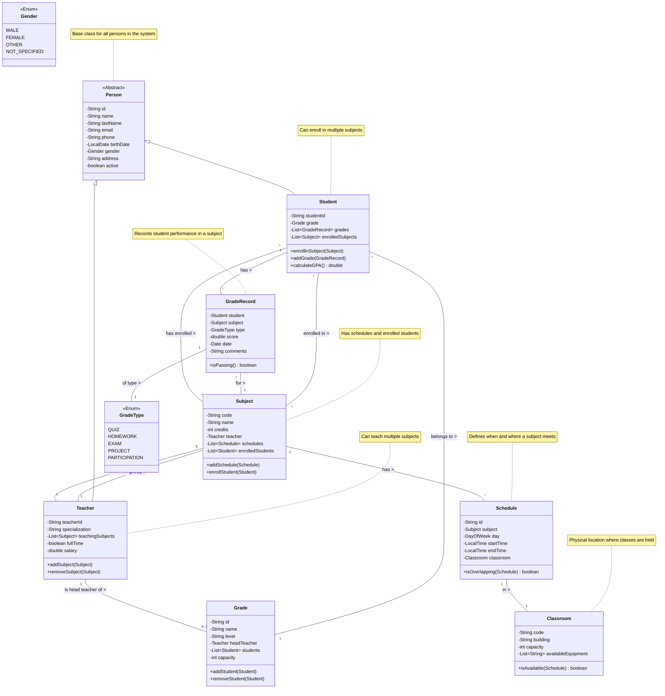

```mermaid
classDiagram
    class Person {
        <<Abstract>>
        -String id
        -String name
        -String lastName
        -String email
        -String phone
        -LocalDate birthDate
        -Gender gender
        -String address
        -boolean active
    }

    class Student {
        -String studentId
        -Grade grade
        -List~GradeRecord~ grades
        -List~Subject~ enrolledSubjects
        +enrollInSubject(Subject)
        +addGrade(GradeRecord)
        +calculateGPA() double
    }

    class Teacher {
        -String teacherId
        -String specialization
        -List~Subject~ teachingSubjects
        -boolean fullTime
        -double salary
        +addSubject(Subject)
        +removeSubject(Subject)
    }

    class Subject {
        -String code
        -String name
        -int credits
        -Teacher teacher
        -List~Schedule~ schedules
        -List~Student~ enrolledStudents
        +addSchedule(Schedule)
        +enrollStudent(Student)
    }

    class Grade {
        -String id
        -String name
        -String level
        -Teacher headTeacher
        -List~Student~ students
        -int capacity
        +addStudent(Student)
        +removeStudent(Student)
    }

    class GradeRecord {
        -Student student
        -Subject subject
        -GradeType type
        -double score
        -Date date
        -String comments
        +isPassing() boolean
    }

    class GradeType {
        <<Enum>>
        QUIZ
        HOMEWORK
        EXAM
        PROJECT
        PARTICIPATION
    }

    class Schedule {
        -String id
        -Subject subject
        -DayOfWeek day
        -LocalTime startTime
        -LocalTime endTime
        -Classroom classroom
        +isOverlapping(Schedule) boolean
    }

    class Classroom {
        -String code
        -String building
        -int capacity
        -List~String~ availableEquipment
        +isAvailable(Schedule) boolean
    }

    class Gender {
        <<Enum>>
        MALE
        FEMALE
        OTHER
        NOT_SPECIFIED
    }

    Person <|-- Student
    Person <|-- Teacher
    
    Student "1" -- "*" GradeRecord : has >
    Student "*" -- "1" Grade : belongs to >
    Student "*" -- "*" Subject : enrolled in >
    
    Subject "1" -- "*" Schedule : has >
    Subject "1" -- "1" Teacher : taught by >
    Subject "*" -- "*" Student : has enrolled >
    
    Teacher "1" -- "*" Subject : teaches >
    Teacher "1" -- "0..1" Grade : is head teacher of >
    
    GradeRecord "*" -- "1" Subject : for >
    GradeRecord "1" -- "1" GradeType : of type >
    
    Schedule "1" -- "1" Classroom : in >
    
    note for Person "Base class for all persons in the system"
    note for Student "Can enroll in multiple subjects"
    note for Teacher "Can teach multiple subjects"
    note for Subject "Has schedules and enrolled students"
    note for GradeRecord "Records student performance in a subject"
    note for Schedule "Defines when and where a subject meets"
    note for Classroom "Physical location where classes are held"
```
